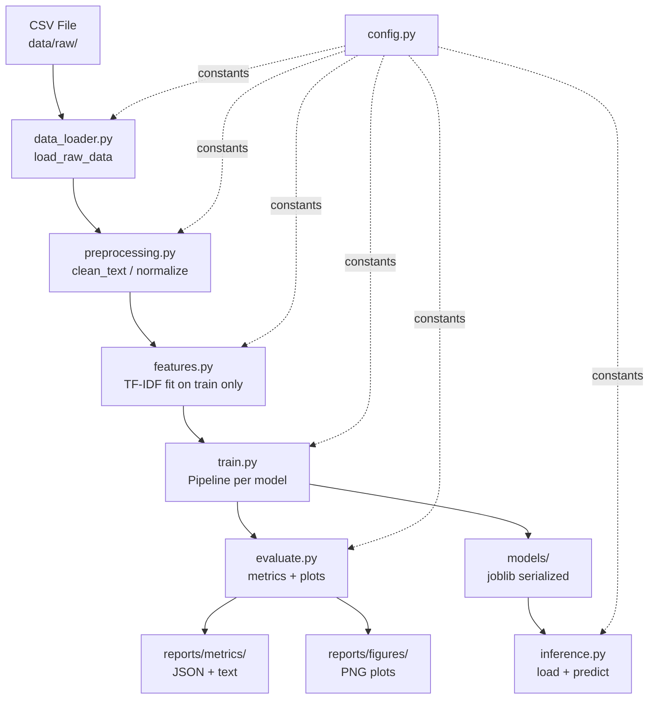
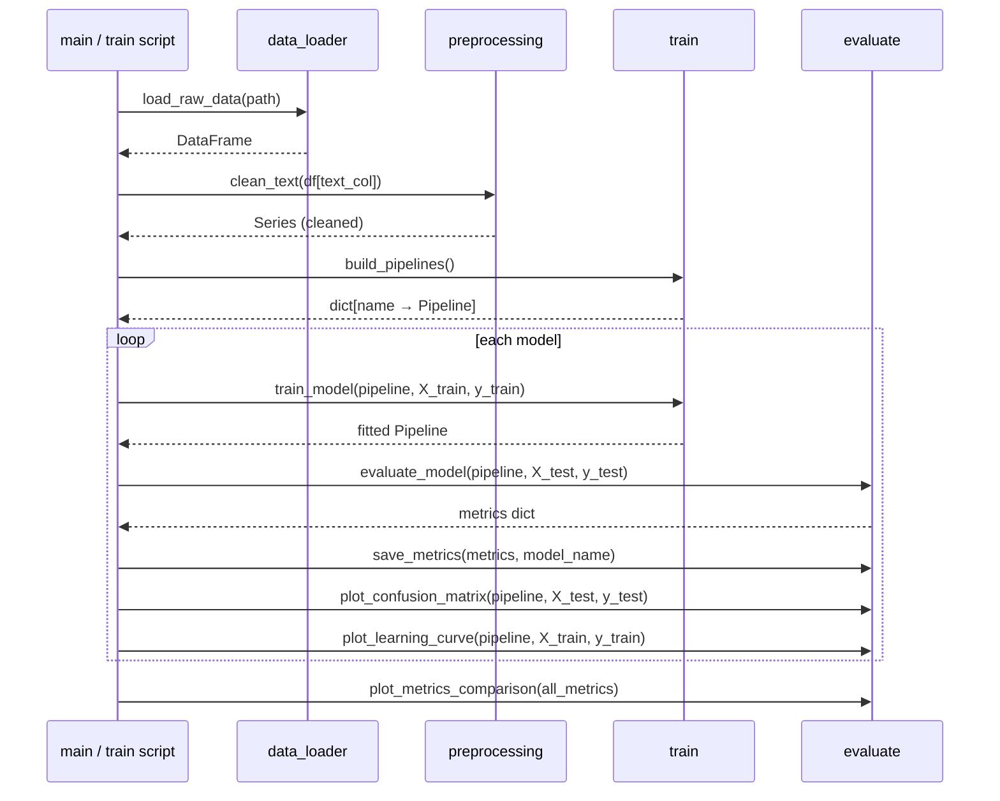
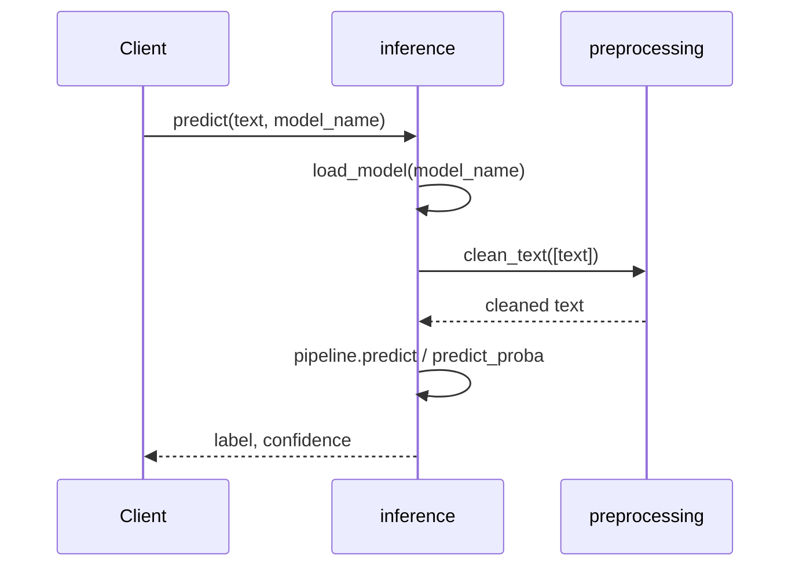

# Design Document: NLP Classification Pipeline

## Overview

An end-to-end, modular text classification pipeline built on classical NLP and scikit-learn. Raw CSV data flows through cleaning, TF-IDF feature extraction, and five parallel sklearn `Pipeline` objects — one per classifier — before evaluation metrics and diagnostic plots are persisted to disk. The design is intentionally single-responsibility per module so each stage can be understood, tested, and extended in isolation.

The pipeline supports both batch training (CSV → trained model files) and single-sample inference (string → predicted label + confidence). Overfitting/underfitting diagnostics are first-class outputs alongside standard classification metrics.

---

## Architecture



---

## Sequence Diagrams

### Training Flow



### Inference Flow



---

## Components and Interfaces

### config.py

**Purpose**: Single source of truth for all constants — paths, hyperparameters, column names.

```python
# src/config.py (representative constants)
DATA_RAW_PATH: str        # "data/raw/"
DATA_PROCESSED_PATH: str  # "data/processed/"
MODELS_PATH: str          # "models/"
METRICS_PATH: str         # "reports/metrics/"
FIGURES_PATH: str         # "reports/figures/"

TEXT_COLUMN: str          # column name for raw text
LABEL_COLUMN: str         # column name for target labels
TEST_SIZE: float          # e.g. 0.2
RANDOM_STATE: int         # e.g. 42

TFIDF_MAX_FEATURES: int   # e.g. 10000
TFIDF_NGRAM_RANGE: tuple  # (1, 2)
TFIDF_STOP_WORDS: str     # "english" or None
```

---

### data_loader.py

**Purpose**: Load raw CSV data into a DataFrame; validate required columns exist.

```python
def load_raw_data(filepath: str) -> pd.DataFrame:
    """Load CSV from filepath and return a DataFrame."""

def validate_columns(df: pd.DataFrame, required: list[str]) -> None:
    """Raise ValueError if any required column is missing from df."""
```

---

### preprocessing.py

**Purpose**: Clean and normalize raw text; handle missing values.

```python
def clean_text(text: str) -> str:
    """Lowercase, strip HTML/punctuation, and normalize whitespace."""

def remove_missing(df: pd.DataFrame, col: str) -> pd.DataFrame:
    """Drop rows where col is null or empty string."""

def tokenize(text: str) -> list[str]:
    """Tokenize text using nltk word_tokenize."""

def remove_stopwords(tokens: list[str], lang: str = "english") -> list[str]:
    """Remove NLTK stopwords from token list."""

def stem_tokens(tokens: list[str]) -> list[str]:
    """Apply PorterStemmer to each token."""

def lemmatize_tokens(tokens: list[str]) -> list[str]:
    """Apply WordNetLemmatizer to each token."""

def preprocess_series(series: pd.Series, use_stemming: bool = False,
                       use_lemmatization: bool = True) -> pd.Series:
    """Apply full preprocessing pipeline to a text Series."""
```

---

### features.py

**Purpose**: Build and apply TF-IDF vectorization; fit only on training data.

```python
def build_tfidf(ngram_range: tuple, max_features: int,
                stop_words: str | None) -> TfidfVectorizer:
    """Instantiate a TfidfVectorizer with given hyperparameters."""

def fit_transform_tfidf(vectorizer: TfidfVectorizer,
                         X_train: pd.Series) -> scipy.sparse.csr_matrix:
    """Fit vectorizer on X_train and return transformed matrix."""

def transform_tfidf(vectorizer: TfidfVectorizer,
                     X: pd.Series) -> scipy.sparse.csr_matrix:
    """Transform X using an already-fitted vectorizer."""
```

> Note: When using `sklearn.Pipeline`, the vectorizer is embedded inside the pipeline and these functions serve as standalone utilities for exploratory use. The pipeline handles fit/transform discipline automatically.

---

### train.py

**Purpose**: Construct one `sklearn.Pipeline` per classifier and train each on the same data split.

```python
def build_pipelines(tfidf_params: dict) -> dict[str, Pipeline]:
    """Return a dict mapping model name → unfitted sklearn Pipeline."""

def train_model(pipeline: Pipeline, X_train: pd.Series,
                y_train: pd.Series) -> Pipeline:
    """Fit pipeline on training data and return the fitted pipeline."""

def save_model(pipeline: Pipeline, model_name: str) -> None:
    """Serialize fitted pipeline to models/ via joblib."""
```

Pipeline construction example:
```python
{
  "naive_bayes":         Pipeline([("tfidf", TfidfVectorizer(**p)), ("clf", MultinomialNB())]),
  "logistic_regression": Pipeline([("tfidf", TfidfVectorizer(**p)), ("clf", LogisticRegression())]),
  "svm":                 Pipeline([("tfidf", TfidfVectorizer(**p)), ("clf", LinearSVC())]),
  "decision_tree":       Pipeline([("tfidf", TfidfVectorizer(**p)), ("clf", DecisionTreeClassifier())]),
  "random_forest":       Pipeline([("tfidf", TfidfVectorizer(**p)), ("clf", RandomForestClassifier())]),
}
```

---

### evaluate.py

**Purpose**: Compute metrics, detect over/underfitting, and persist plots and reports.

```python
def evaluate_model(pipeline: Pipeline, X_test: pd.Series,
                   y_test: pd.Series) -> dict:
    """Return accuracy, precision, recall, F1 for a fitted pipeline."""

def compute_train_test_scores(pipeline: Pipeline, X_train: pd.Series,
                               y_train: pd.Series, X_test: pd.Series,
                               y_test: pd.Series) -> dict:
    """Return train_score and test_score to detect over/underfitting."""

def plot_confusion_matrix(pipeline: Pipeline, X_test: pd.Series,
                           y_test: pd.Series, model_name: str) -> None:
    """Save confusion matrix heatmap to reports/figures/."""

def plot_learning_curve(pipeline: Pipeline, X: pd.Series,
                         y: pd.Series, model_name: str) -> None:
    """Save learning curve plot to reports/figures/."""

def plot_metrics_comparison(all_metrics: dict[str, dict]) -> None:
    """Save grouped bar chart comparing all models to reports/figures/."""

def save_metrics(metrics: dict, model_name: str) -> None:
    """Write metrics dict as JSON to reports/metrics/."""
```

---

### inference.py

**Purpose**: Load a serialized pipeline and run predictions on new text input.

```python
def load_model(model_name: str) -> Pipeline:
    """Load and return a fitted pipeline from models/ via joblib."""

def predict(text: str, model_name: str) -> tuple[str, float]:
    """Preprocess text, run prediction, return (label, confidence)."""
```

---

### utils.py

**Purpose**: Shared helpers used across modules (logging, path resolution, timing).

```python
def ensure_dir(path: str) -> None:
    """Create directory at path if it does not exist."""

def get_timestamp() -> str:
    """Return current UTC timestamp as a formatted string."""

def log_info(message: str) -> None:
    """Print a formatted info log line."""
```

---

## Data Models

### RawRecord

```python
# Conceptual schema of each row in the input CSV
{
    TEXT_COLUMN:  str,   # raw text (e.g. email body, review)
    LABEL_COLUMN: str,   # target class label (e.g. "spam", "positive")
}
```

**Validation Rules**:
- `TEXT_COLUMN` must be non-null and non-empty after stripping whitespace
- `LABEL_COLUMN` must be non-null; label set must have ≥ 2 distinct values
- Rows failing validation are dropped before any processing

### MetricsRecord

```python
{
    "model_name": str,
    "accuracy":   float,   # [0.0, 1.0]
    "precision":  float,   # macro-averaged
    "recall":     float,   # macro-averaged
    "f1":         float,   # macro-averaged
    "train_score": float,  # for over/underfitting diagnosis
    "test_score":  float,
}
```

---

## Algorithmic Pseudocode

### Main Training Algorithm

```pascal
ALGORITHM run_training_pipeline(csv_path)
INPUT: csv_path — path to raw CSV file
OUTPUT: trained model files in models/, metrics in reports/

BEGIN
  // 1. Load and validate
  df ← load_raw_data(csv_path)
  validate_columns(df, [TEXT_COLUMN, LABEL_COLUMN])
  df ← remove_missing(df, TEXT_COLUMN)

  // 2. Preprocess
  df[TEXT_COLUMN] ← preprocess_series(df[TEXT_COLUMN])

  // 3. Split
  X_train, X_test, y_train, y_test ← train_test_split(
      df[TEXT_COLUMN], df[LABEL_COLUMN],
      test_size=TEST_SIZE, random_state=RANDOM_STATE, stratify=df[LABEL_COLUMN]
  )

  // 4. Build pipelines
  pipelines ← build_pipelines(tfidf_params)

  // 5. Train, evaluate, persist
  all_metrics ← {}
  FOR each (name, pipeline) IN pipelines DO
    ASSERT X_train is non-empty AND y_train is non-empty

    fitted ← train_model(pipeline, X_train, y_train)
    save_model(fitted, name)

    metrics ← evaluate_model(fitted, X_test, y_test)
    scores  ← compute_train_test_scores(fitted, X_train, y_train, X_test, y_test)
    metrics ← MERGE(metrics, scores)

    save_metrics(metrics, name)
    plot_confusion_matrix(fitted, X_test, y_test, name)
    plot_learning_curve(fitted, X_train, y_train, name)

    all_metrics[name] ← metrics
  END FOR

  plot_metrics_comparison(all_metrics)

  ASSERT all model files exist in models/
  ASSERT all metric files exist in reports/metrics/
END
```

**Preconditions**:
- `csv_path` points to a readable CSV with at least `TEXT_COLUMN` and `LABEL_COLUMN`
- NLTK corpora (`stopwords`, `wordnet`, `punkt`) are downloaded

**Postconditions**:
- One `.joblib` file per model in `models/`
- One JSON metrics file per model in `reports/metrics/`
- Confusion matrix and learning curve PNG per model in `reports/figures/`
- Comparison bar chart in `reports/figures/`

**Loop Invariant**: At the start of each iteration, `all_metrics` contains only fully evaluated models from previous iterations.

---

### Text Preprocessing Algorithm

```pascal
ALGORITHM preprocess_series(series, use_stemming, use_lemmatization)
INPUT: series — pd.Series of raw text strings
OUTPUT: pd.Series of cleaned, normalized text strings

BEGIN
  result ← []

  FOR each text IN series DO
    // Normalize
    text ← lowercase(text)
    text ← strip_html_tags(text)
    text ← remove_punctuation(text)
    text ← collapse_whitespace(text)

    // Tokenize
    tokens ← word_tokenize(text)

    // Remove stopwords
    tokens ← [t FOR t IN tokens IF t NOT IN stopwords("english")]

    // Morphological normalization (mutually exclusive preference)
    IF use_stemming THEN
      tokens ← stem_tokens(tokens)
    ELSE IF use_lemmatization THEN
      tokens ← lemmatize_tokens(tokens)
    END IF

    result.append(JOIN(tokens, " "))
  END FOR

  RETURN pd.Series(result)
END
```

**Preconditions**: `series` is a non-empty `pd.Series` of strings (nulls already removed).
**Postconditions**: Each element is a lowercase, punctuation-free, normalized string.
**Loop Invariant**: All previously processed texts in `result` are fully normalized.

---

### Overfitting / Underfitting Diagnosis Algorithm

```pascal
ALGORITHM diagnose_fit(train_score, test_score, threshold)
INPUT: train_score, test_score — floats in [0, 1]; threshold — float (e.g. 0.10)
OUTPUT: diagnosis — one of {"overfit", "underfit", "good_fit"}

BEGIN
  gap ← train_score - test_score

  IF train_score < 0.70 AND test_score < 0.70 THEN
    RETURN "underfit"   // both scores low → model too simple
  ELSE IF gap > threshold THEN
    RETURN "overfit"    // large gap → model memorized training data
  ELSE
    RETURN "good_fit"
  END IF
END
```

**Preconditions**: Both scores are in [0.0, 1.0]; threshold > 0.
**Postconditions**: Returns a deterministic string label.

---

## Key Functions with Formal Specifications

### `preprocess_series(series, use_stemming, use_lemmatization)`

**Preconditions**:
- `series` is a `pd.Series` with no null values
- `use_stemming` and `use_lemmatization` are not both `True`

**Postconditions**:
- Returns a `pd.Series` of equal length
- Every element is a non-null, lowercase string
- No element contains HTML tags or leading/trailing whitespace

**Loop Invariant**: All elements appended to `result` so far are fully normalized strings.

---

### `build_pipelines(tfidf_params)`

**Preconditions**:
- `tfidf_params` contains valid keys: `ngram_range`, `max_features`, `stop_words`
- `ngram_range` is a tuple `(min_n, max_n)` where `1 ≤ min_n ≤ max_n`

**Postconditions**:
- Returns a `dict` with exactly 5 keys: `naive_bayes`, `logistic_regression`, `svm`, `decision_tree`, `random_forest`
- Each value is an unfitted `sklearn.Pipeline` with steps `[("tfidf", ...), ("clf", ...)]`
- No pipeline has been fitted (no data leakage possible at this stage)

---

### `evaluate_model(pipeline, X_test, y_test)`

**Preconditions**:
- `pipeline` is a fitted `sklearn.Pipeline`
- `X_test` and `y_test` have the same length > 0
- `y_test` contains only labels seen during training

**Postconditions**:
- Returns a `dict` with keys: `accuracy`, `precision`, `recall`, `f1`
- All values are floats in `[0.0, 1.0]`
- `pipeline` is not mutated

---

### `predict(text, model_name)`

**Preconditions**:
- `text` is a non-empty string
- A `.joblib` file for `model_name` exists in `models/`

**Postconditions**:
- Returns `(label, confidence)` where `label` is a string and `confidence ∈ [0.0, 1.0]`
- The loaded pipeline is not persisted to memory between calls (stateless inference)

---

## Example Usage

```python
# --- Training ---
from src.data_loader import load_raw_data, validate_columns
from src.preprocessing import remove_missing, preprocess_series
from src.train import build_pipelines, train_model, save_model
from src.evaluate import evaluate_model, compute_train_test_scores, save_metrics
from src.config import TEXT_COLUMN, LABEL_COLUMN, TEST_SIZE, RANDOM_STATE, TFIDF_PARAMS
from sklearn.model_selection import train_test_split

df = load_raw_data("data/raw/dataset.csv")
validate_columns(df, [TEXT_COLUMN, LABEL_COLUMN])
df = remove_missing(df, TEXT_COLUMN)
df[TEXT_COLUMN] = preprocess_series(df[TEXT_COLUMN])

X_train, X_test, y_train, y_test = train_test_split(
    df[TEXT_COLUMN], df[LABEL_COLUMN],
    test_size=TEST_SIZE, random_state=RANDOM_STATE, stratify=df[LABEL_COLUMN]
)

pipelines = build_pipelines(TFIDF_PARAMS)
for name, pipeline in pipelines.items():
    fitted = train_model(pipeline, X_train, y_train)
    save_model(fitted, name)
    metrics = evaluate_model(fitted, X_test, y_test)
    save_metrics(metrics, name)

# --- Inference ---
from src.inference import predict

label, confidence = predict("Congratulations! You've won a free prize.", "logistic_regression")
print(f"Predicted: {label} ({confidence:.2%})")
```

---

## Correctness Properties

1. **No data leakage**: For all pipelines `p` and any test set `X_test`, `p` was never fitted on any subset of `X_test`.
2. **Metric bounds**: For all models, `accuracy`, `precision`, `recall`, `f1 ∈ [0.0, 1.0]`.
3. **Vectorizer discipline**: The `TfidfVectorizer` inside each pipeline is fitted exactly once — on `X_train` — and reused for all subsequent transforms.
4. **Identical conditions**: All five models are trained on the same `(X_train, y_train)` split and evaluated on the same `(X_test, y_test)` split.
5. **Preprocessing idempotency**: Applying `preprocess_series` twice to the same input produces the same output as applying it once.
6. **Model persistence completeness**: After `save_model(fitted, name)`, a file at `models/{name}.joblib` exists and `load_model(name)` returns a pipeline that produces identical predictions to `fitted`.
7. **Overfitting diagnosis soundness**: If `train_score - test_score > threshold`, the diagnosis is `"overfit"`; if both scores are below 0.70, the diagnosis is `"underfit"`.

---

## Error Handling

### Missing Columns in CSV

**Condition**: `TEXT_COLUMN` or `LABEL_COLUMN` not found in loaded DataFrame.
**Response**: `validate_columns` raises `ValueError` with a descriptive message listing missing columns.
**Recovery**: User corrects `TEXT_COLUMN` / `LABEL_COLUMN` in `config.py` and reruns.

### All-Null Text Column

**Condition**: After `remove_missing`, the DataFrame is empty.
**Response**: Raise `ValueError("No valid text samples remain after removing missing values.")`.
**Recovery**: User inspects the CSV for data quality issues.

### NLTK Resource Missing

**Condition**: `stopwords`, `wordnet`, or `punkt` not downloaded.
**Response**: `nltk.download` call in a `utils.ensure_nltk_resources()` guard raises `LookupError` with resource name.
**Recovery**: `utils.ensure_nltk_resources()` is called at pipeline entry point to auto-download.

### Model File Not Found at Inference

**Condition**: `models/{model_name}.joblib` does not exist.
**Response**: `load_model` raises `FileNotFoundError` with the expected path.
**Recovery**: User runs the training pipeline first to generate model files.

### LinearSVC Confidence Scores

**Condition**: `LinearSVC` does not natively support `predict_proba`.
**Response**: Wrap with `CalibratedClassifierCV` in `build_pipelines` when probability output is required; otherwise return decision function score normalized to [0, 1].
**Recovery**: Handled transparently inside `inference.predict`.

---

## Testing Strategy

### Unit Testing Approach

Each module is tested in isolation with small, synthetic fixtures:
- `test_data_loader.py` — valid CSV, missing columns, empty file
- `test_preprocessing.py` — HTML stripping, null removal, stemming vs. lemmatization output
- `test_features.py` — vectorizer fit/transform discipline (no refit on test)
- `test_train.py` — pipeline structure (correct steps, correct classifier types)
- `test_evaluate.py` — metric bounds, file creation side effects
- `test_inference.py` — round-trip: save model → load → predict returns valid label

### Property-Based Testing Approach

**Property Test Library**: `hypothesis`

Key properties to test:
- `preprocess_series` is idempotent: `f(f(x)) == f(x)` for any string series
- `evaluate_model` always returns metrics in `[0.0, 1.0]` for any valid split
- `build_pipelines` always returns exactly 5 pipelines regardless of `tfidf_params` values
- `diagnose_fit` is total: for any `(train_score, test_score) ∈ [0,1]²`, it returns one of the three valid labels

### Integration Testing Approach

End-to-end smoke test using a small synthetic CSV (100 rows, 2 classes):
1. Run full training pipeline
2. Assert all 5 model files exist in `models/`
3. Assert all 5 metric JSON files exist in `reports/metrics/`
4. Assert all figure PNGs exist in `reports/figures/`
5. Run inference on 3 sample texts and assert valid `(label, confidence)` tuples returned

---

## Performance Considerations

- `TfidfVectorizer` with `max_features=10000` and `ngram_range=(1,2)` produces sparse matrices; memory usage scales with vocabulary size, not corpus size.
- `RandomForestClassifier` and `LinearSVC` are the most compute-intensive; default `n_estimators=100` for RF is acceptable for datasets up to ~100k samples.
- Learning curve computation (`plot_learning_curve`) uses cross-validation and is the slowest step — run after all models are trained.
- All I/O (CSV read, joblib save/load) is synchronous; no async handling needed at this scale.

---

## Security Considerations

- Input text at inference time is passed through the same preprocessing pipeline as training data — no raw string is ever executed.
- Model files loaded via `joblib.load` should only be loaded from trusted paths (the local `models/` directory); never load from user-supplied paths without validation.
- No credentials, API keys, or PII should appear in `config.py` — only structural constants.

---

## Dependencies

| Package | Version | Purpose |
|---|---|---|
| `pandas` | ≥ 1.5 | DataFrame I/O and manipulation |
| `numpy` | ≥ 1.23 | Numerical operations |
| `scikit-learn` | ≥ 1.2 | Pipelines, vectorizer, classifiers, metrics |
| `nltk` | ≥ 3.8 | Tokenization, stopwords, stemming, lemmatization |
| `joblib` | ≥ 1.2 | Model serialization |
| `matplotlib` | ≥ 3.6 | Plot generation |
| `seaborn` | ≥ 0.12 | Styled heatmaps and bar charts |
| `scipy` | ≥ 1.9 | Sparse matrix support (used by TF-IDF) |
| `hypothesis` | ≥ 6.0 | Property-based testing |
